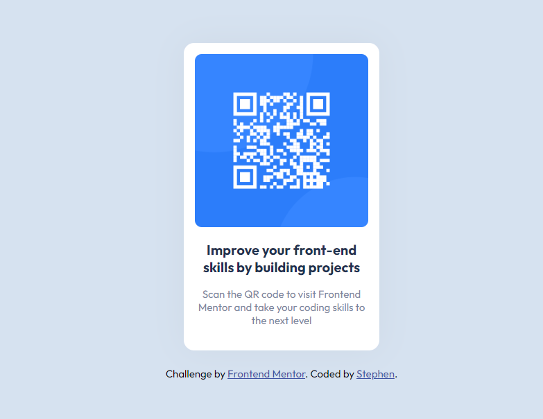

# Frontend Mentor - QR code component

## Welcome! 👋

Thanks for checking out this front-end coding challenge.

# Frontend Mentor - QR code component solution

This is a solution to the [QR code component challenge on Frontend Mentor](https://www.frontendmentor.io/challenges/qr-code-component-iux_sIO_H). Frontend Mentor challenges help you improve your coding skills by building realistic projects.

### Links

- Solution URL: https://github.com/xaintobas/qrcode.git
- Live Site URL: https://xaintobas.github.io/qrcode/

### Built with

- Semantic HTML5 markup
- CSS custom properties
- Flexbox
- Mobile-first workflow

### What I learned

After completing this challenge, I have some ideas on using Flexbox.
I also learned the justify-content and align-items properties and how they really function.

### Continued development

In future projects, I would want to focus more on building advanced layouts using flex box. Sometimes I still make some mistakes with some of the CSS properties that goes with flexbox.

## Author

- Website - Stephen [https://xaintobas.github.io/qrcode/]
- Frontend Mentor - https://www.frontendmentor.io/profile/xaintobas
- Twitter - https://x.com/xaint_obas
